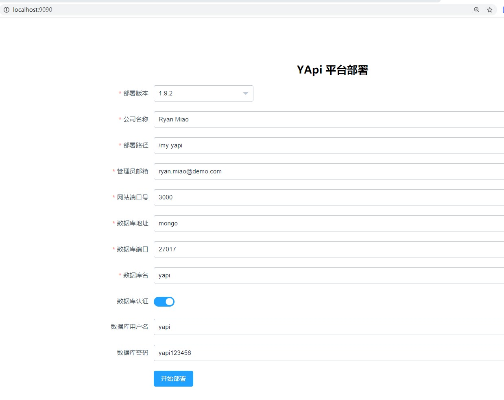
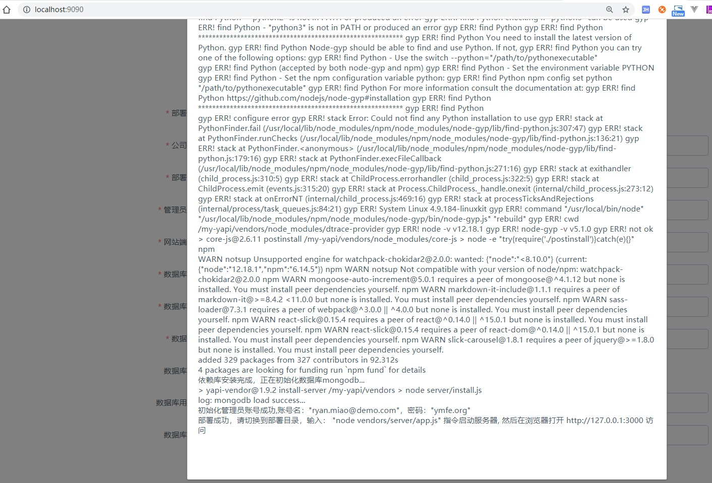
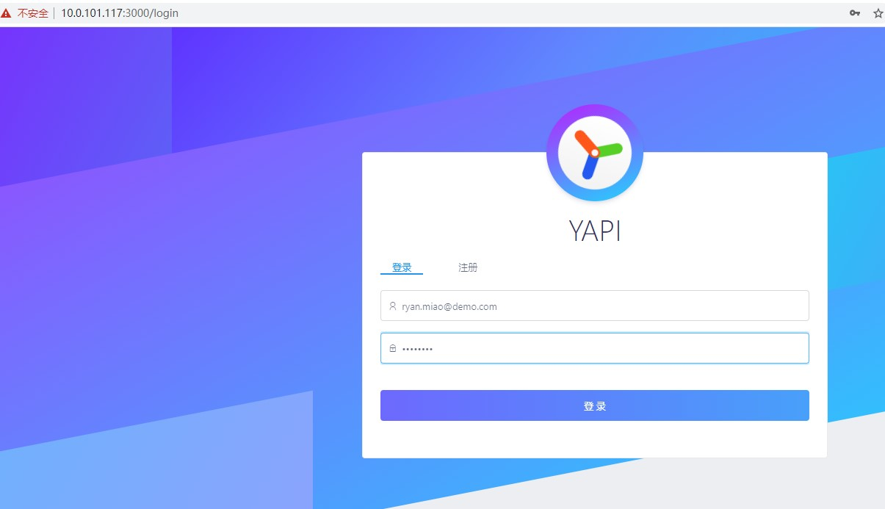
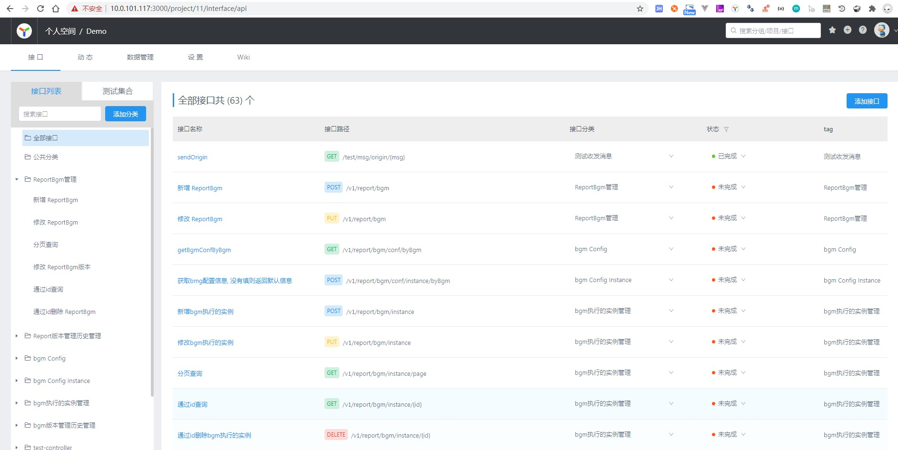

YApi Docker镜像
==============


YApi:  https://github.com/YMFE/yapi/releases

制作本地的yapi docker镜像, docker-compose一键维护和部署.

## How

1. 初始化db, 开启自定义配置

```
git clone https://github.com/Ryan-Miao/docker-yapi.git
cd docker-yapi
docker-compose up
```

打开 localhost:9090

- 默认部署路径为`/my-yapi`(需要修改docker-compose.yml才可以更改)
- 修改管理员邮箱 `ryan.miao@demo.com` (随意, 修改为自己的邮箱)
- 修改数据库地址为 `mongo` 或者修改为自己的mongo实例 (docker-compose配置的mongo服务名称叫mongo)
- 打开数据库认证
- 输入数据库用户名: `yapi`(mongo配置的用户名, 见mongo-conf/init-mongo.js)
- 输入密码: `yapi123456`(mongo配置的密码, 见mongo-conf/init-mongo.js)

点击开始部署.




2. 部署完毕后, 修改docker-compose.yml
启用

```
  yapi:
    build:
      context: ./
      dockerfile: Dockerfile
    image: yapi
    # 第一次启动使用
    # command: "yapi server"
    # 之后使用下面的命令
    command: "node /my-yapi/vendors/server/app.js"
```

重启服务:

```
docker-compose up
```

访问 localhost:3000

- 输入用户名ryan.miao@demo.com(自己输入的管理员邮箱)
- 输入密码ymfe.org(默认的初始化密码, 之后可以修改)

然后可以导入一个swagger的接口数据试试:





3. 后台启动

前台启动确认没问题后, 直接
```
docker-compose stop或者contrl+C
docker-compose up -d
```


## 数据备份

所有数据都在mongo中, 理论上建议使用自己搭建的mongo实例, 这里docker的mongo也可以使用, 只要备份本mongo数据即可.

可以使用mongodb的备份方式, 也可以直接备份mongo/data.


## 版本升级

可以看出, 只要重新找个机器部署一遍, 然后导入mongo数据即可.


## 一些配置

**部署路径**

容器采用的`node:12-alpine` 这个镜像, yapi部署目录默认为`my-yapi`. 这里已经映射到本地磁盘, 也可以自己挂载想要的数据盘.

在docker-compose中配置了, 本地目录映射到容器目录`my-yapi`

```
    volumes: 
        - ./my-yapi:/my-yapi
```


**Mongo配置**

本方案直接使用docker-compose的mongo. 定义了初始化脚本init-mongo.js. 修改即可修改账号和密码.


**插件等配置**

已经把yapi部署文件给映射到磁盘了, 该怎么安装就怎么安装.

注意yapi目前处于无人维护状态，源码有一些问题，直接下载安装插件可能失败，具体见 https://www.cnblogs.com/woshimrf/p/13797749.html#_caption_1

```
.
├── doc
│   ├── init-2.jpg
│   └── init.jpg
├── docker-compose.yml
├── Dockerfile
├── mongo
│   ├── data
│   │   └── db
│   └── etc
├── mongo-conf
│   └── init-mongo.js
├── my-yapi
│   ├── config.json
│   ├── init.lock
│   ├── log
│   │   └── 2020-6.log
│   └── vendors
│       ├── aa.js
│       ├── CHANGELOG.md
│       ├── client
│       ├── common
│       ├── config_example.json
│       ├── exts
│       ├── LICENSE
│       ├── node_modules
│       ├── nodemon.json
│       ├── npm-publish.js
│       ├── package.json
│       ├── package-lock.json
│       ├── plugin.json
│       ├── README.md
│       ├── server
│       ├── static
│       ├── webpack.alias.js
│       ├── yapi-base-flow.jpg
│       └── ykit.config.js
├── readme.md
└── repositories
```


